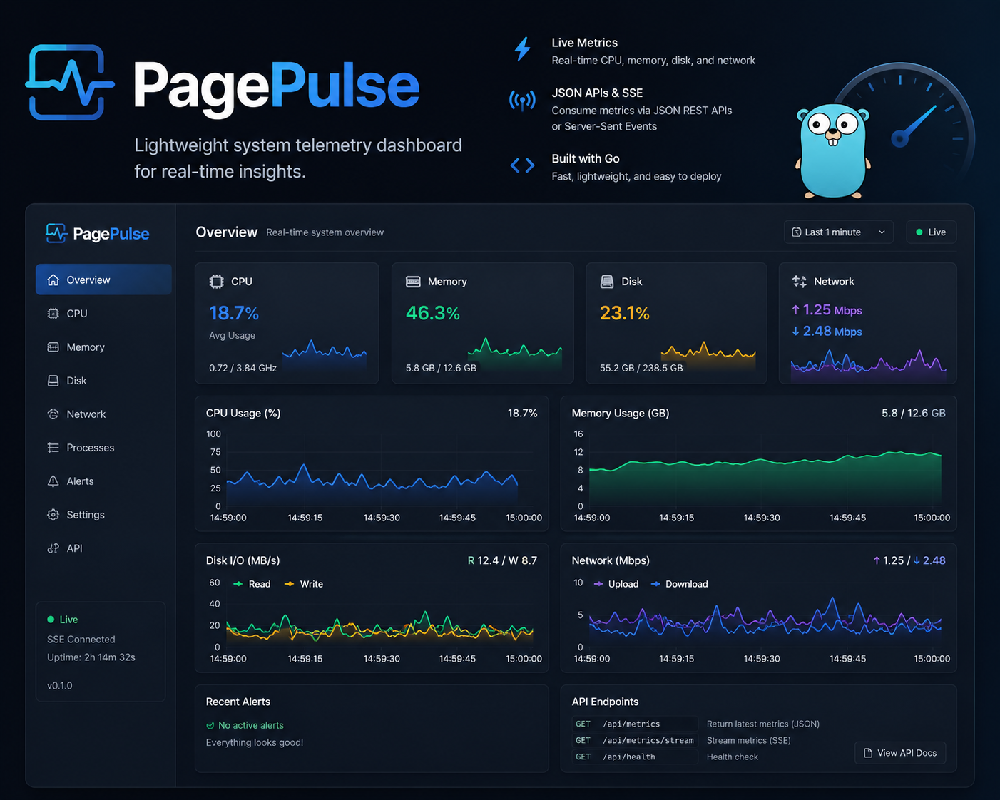

# PagePulse



PagePulse is a lightweight telemetry dashboard for host monitoring. It samples CPU, memory, disk, and network metrics, exposes them via HTTP APIs and SSE, and renders a real-time web UI from embedded static assets.

## Highlights
- Real-time dashboard with CPU, memory, disk, and network cards
- Server-Sent Events stream for live updates
- Host/resource metadata endpoint with filtered disk/interface catalog
- Build/version visibility in UI and API (helps detect stale binaries)
- Cross-platform release artifacts via GitHub Actions

## Quick Start
```bash
go run ./cmd/pagepulse
```

Open `http://127.0.0.1:8421`.

Common flags:
```bash
go run ./cmd/pagepulse --host 127.0.0.1 --port 8421 --sample-interval 1s
go run ./cmd/pagepulse --public --port 8421
```

## Development
```bash
gofmt -w .
go test ./...
go test -race ./...
go build -o pagepulse ./cmd/pagepulse
```

Build with explicit metadata:
```bash
go build -ldflags "-X 'pagepulse/internal/buildinfo.Version=v0.1.0' -X 'pagepulse/internal/buildinfo.Commit=$(git rev-parse --short HEAD)' -X 'pagepulse/internal/buildinfo.BuildTime=$(date -u +%Y-%m-%dT%H:%M:%SZ)'" -o pagepulse ./cmd/pagepulse
```

## API
- `GET /api/v1/summary`: current metrics and trend history
- `GET /api/v1/resources`: host, CPU core count, filtered disks/interfaces
- `GET /api/v1/version`: binary version, commit, build time, Go version
- `GET /api/v1/stream`: SSE `summary` events

## CI/CD and Releases
- `.github/workflows/ci.yml`: format check, unit tests, race tests, multi-OS build validation
- `.github/workflows/auto-tag.yml`: semantic version auto-tagging on `main`
- `.github/workflows/release.yml`: builds and publishes release binaries on `v*` tags

One-time setup:
- Add repo secret `RELEASE_PAT` with repo write permissions.

Version bump rules:
- `feat: ...` -> minor
- commit body containing `BREAKING CHANGE` -> major
- all other commits -> patch
- add `[skip-tag]` in commit message to bypass auto-tagging

Release assets include Linux/macOS/Windows binaries (amd64 + arm64) and `.sha256` checksum files.

## Roadmap
- Frontend unit tests for rendering/formatting logic
- Optional user-configurable disk/interface filters
- Export and alerting capabilities
